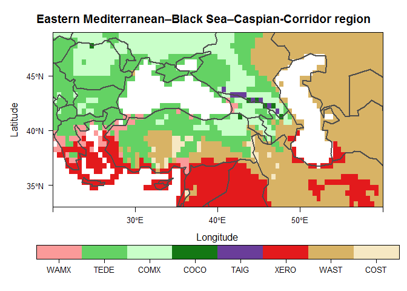

# macroBiome

macroBiome is an R package that provides functions with both point and grid modes for simulating biomes by equilibrium vegetation models, with a special focus on paleoenvironmental applications.

Two widely used equilibrium biome models are currently implemented in the package: the Holdridge Life Zone (HLZ) system ([Holdridge 1947](https://doi.org/10.1126/science.105.2727.367)) and the BIOME model ([Prentice et al. 1992](https://doi.org/10.2307/2845499)). Three climatic forest-steppe models are also implemented.

An approach for estimating monthly time series of relative sunshine duration from temperature and precipitation data ([Yin 1999](https://doi.org/10.1007/s007040050111)) is also adapted, allowing process-based biome models to be combined with high-resolution paleoclimate simulation datasets (e.g., [CHELSA-TraCE21k v1.0 dataset](https://chelsa-climate.org/chelsa-trace21k/)).

## Installation

Installing the latest stable version from CRAN:

``` r
install.packages("macroBiome")
```

You can install the development version of macroBiome like so:

``` r
if (!require(devtools)) install.packages("devtools")
devtools::install_github("szelepcsenyi/macroBiome")
```

## Example

Create a biome map of the Eastern Mediterranean--Black Sea--Caspian-Corridor region for the period 1991-2020 using the CRU TS v.4.05 dataset [(Harris et al. 2020)](https://doi.org/10.1038/s41597-020-0453-3)

``` r
list.of.packages <- c("R.utils", "rasterVis", "latticeExtra", "rworldmap")
new.packages <- list.of.packages[!(list.of.packages %in% installed.packages()[,"Package"])]
if (length(new.packages)) { install.packages(new.packages) }

library(macroBiome)
library(raster)
library(rasterVis)

# Target domain: Eastern Mediterranean–Black Sea–Caspian-Corridor region
e <- raster(crs = "+proj=longlat +datum=WGS84 +no_defs",
            ext = extent(20., 60., 33., 49.),
            resolution = 0.5)

# Set some magic numbers and parameters
fiyr <- 1991
n_moy <- 12
n_dec <- 3
l_dec <- 10
path <- "https://crudata.uea.ac.uk/cru/data/hrg/cru_ts_4.05/cruts.2103051243.v4.05/"
cv.var_lbl <- c("tmp", "pre", "cld")
cv.ts <- paste0(seq(fiyr, by = l_dec, length.out = n_dec), ".",
                seq(fiyr + l_dec - 1, by = l_dec, length.out = n_dec), ".")

# Download the annual time series of meteorological data, and
# compute their multi-year averages
for (i_var in 1 : length(cv.var_lbl)) {
  rstr <- raster::stack()
  for (i_ts in 1 : length(cv.ts)) {
    fileLCL <- tempfile(fileext = ".nc.gz")
    fileRMT <- paste0(path, cv.var_lbl[i_var], "/cru_ts4.05.",
                      cv.ts[i_ts], cv.var_lbl[i_var], ".dat.nc.gz")
    download.file(fileRMT, destfile = fileLCL, mode = "wb")
    nc <- R.utils::gunzip(fileLCL)
    rstr <- stack(rstr, crop(brick(nc, varname = cv.var_lbl[i_var]), e))
  }
  rstr <- stackApply(rstr, indices = rep(seq(1, n_moy), (n_dec * l_dec)),
                     fun = mean, na.rm = FALSE)
  assign(cv.var_lbl[i_var], round(rstr, 1))
  rm(rstr)
}

# Convert cloudiness values to relative sunshine duration data
# For the approach used, see Doorenbos and Pruitt (1977)
# https://www.fao.org/3/f2430e/f2430e.pdf
bsd <- calc(cld, fun = macroBiome:::cldn2bsdf)

# Download the altitude data (use the TBASE data)
url <- "http://research.jisao.washington.edu/data_sets/elevation/elev.0.5-deg.nc"
tmpy <- tempfile()
download.file(url, tmpy, mode = "wb")
elv <- stack(tmpy)
elv <- crop(rotate(elv), e)
elv[elv < 0.] <- 0.

# Apply the BIOME model
year <- trunc(mean(seq(fiyr, fiyr + (n_dec * l_dec) - 1)))
rs.BIOME <- cliBIOMEGrid(tmp, pre, bsd, elv, sc.year = year)

# Make a color key for vegetation classes used in the BIOME model
Name <- vegClsNumCodes$Code.BIOME[!is.na(vegClsNumCodes$Code.BIOME)]
Col <- c("#01665E", "#5AB4AC", "#8C510A", "#FB9A99", "#64D264", "#C9FFC9",
         "#147814", "#6A3D9A", "#22E6FF", "#0000E7", "#E31A1C", "#D8B365",
         "#F6E8C3", "#CAB2D6", "#FF7F00", "#FDBF6F", "#D1E5F0")
bioColours <- data.frame(Code = seq(1, length(Name)), Name = Name, Col = Col)
rm(Name, Col)

# Reclassify the raw data of the generated biome map
slctd <- as.numeric(levels(factor(values(rs.BIOME)[!is.na(values(rs.BIOME))])))
reclass_mtx <- matrix(c(NA, slctd, NA, seq(1, length(slctd))), ncol = 2)
biome <- ratify(reclassify(rs.BIOME, reclass_mtx))
class <- unlist(lapply(reclass_mtx[-1, 1],
                       function(i) { subset(bioColours, Code == i, select = Name)}))
rat <- data.frame(ID = reclass_mtx[-1, 2], class = class)
levels(biome)[[1]] <- rat

# Plot the biome map
main <- "Eastern Mediterranean–Black Sea–Caspian-Corridor region"
plt <- levelplot(biome, main = main, col.regions = bioColours$Col[slctd],
                 colorkey = list(space = "bottom", height = 1.1), pretty = T,
                 par.settings = list(layout.widths = list(axis.key.padding = 4)))
plt <- plt + latticeExtra::layer(sp.lines(rworldmap::getMap(resolution = 'low'),
                                          col = "gray30", lwd = 2.0))
print(plt)
```



## Citation

``` r
citation("macroBiome")
```

To cite package 'macroBiome' in publications use:

> Szelepcsényi Z (2022) macroBiome: A Tool for Mapping the Distribution of the Biomes and Bioclimate. R package version 0.1.0. <https://github.com/szelepcsenyi/macroBiome>

I have invested a considerable amount of time and effort in creating the package 'macroBiome'. Please cite it if you use it.
